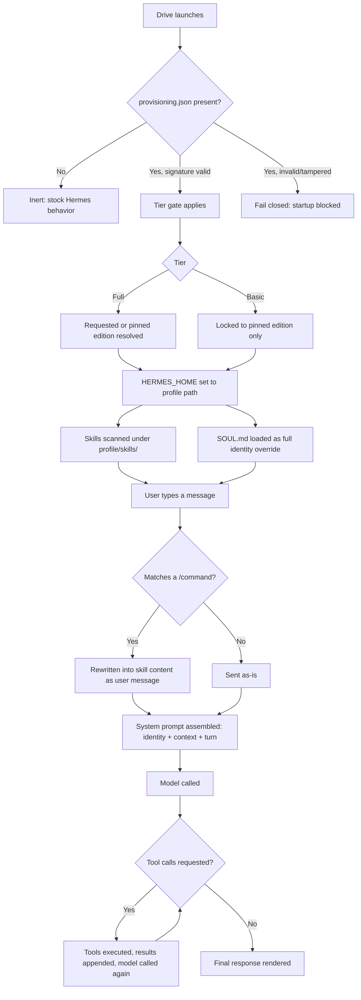

# North Forge — Architecture

This document explains how North Forge actually works internally: how a
private edition gets installed, how tier/pin enforcement gates access,
how `SOUL.md` becomes the running identity, and what happens between a
message and a response. It's written for engineers who want to
understand the mechanism, not for first-time setup — see `README.md` for
that.

Every claim below is grounded in the actual `north-forge-agent` codebase
as of 2026-09-12. File/line references are given so any claim here can
be checked directly against source.

## 1. The two-repo boundary is a single install-time fallback, not a runtime concept

`scripts/nf-setup.ps1:226-252` is the entire mechanism. When an edition
is pinned or installed, the script looks for its manifest in exactly
this order:

1. `editions/<name>/distribution.yaml` — public, tracked in this repo.
2. If absent, `private-editions/<name>/distribution.yaml` — a path this
   repo's own `.gitignore` excludes. An admin puts real content here by
   cloning a private repo directly (e.g. `private-editions/kyocera` ←
   `north-forge-hermes-edition`).
3. If neither resolves: a warning is printed, the pin is still recorded,
   but nothing is installed.

Whichever source wins, the script runs the identical
`hermes profile install <srcDir> -y`. Nothing downstream — skill
discovery, `SOUL.md` loading, tier enforcement — has any code path that
distinguishes where an edition's content originated. The public/private
split exists for exactly one script, at one moment (install time), and
nowhere else in the system.

## 2. Installing an edition: what actually gets copied

`hermes_cli/profile_distribution.py`'s `install_distribution()` reads
and validates the target's `distribution.yaml`, then copies a defined
set of distribution-owned paths — by default `SOUL.md`, `config.yaml`,
`mcp.json`, `skills/`, `cron/`, `distribution.yaml` (overridable per
manifest) — into `<nf-root>/profiles/<name>/`. A separate exclusion list
guarantees credentials, databases, and session/memory state are never
part of that copy, regardless of what a manifest claims to own.

## 3. Tier/pin enforcement: a signed record, checked twice

A provisioned drive carries a signed JSON record
(`<nf-root>/north-forge/provisioning.json`) plus an HMAC key file. Every
read goes through one function, which returns one of three states:

- **No file** → inert. This is a plain dev checkout or stock Hermes; the
  entire tier system does nothing.
- **File present, signature valid** → active. Tier policy applies: a
  *Full*-tier drive can request any installed profile; a *Basic*-tier
  drive is locked to its pinned edition — a request for anything else is
  refused outright.
- **File present but tampered** → the system fails closed. A malformed
  or incorrectly signed record never crashes or falls through to a
  default; it blocks startup with an explicit message.

Enforcement happens at two independent points, not one: once at startup
(before anything else runs), and again as a backstop inside the profile
resolver itself — so even a code path that bypasses the normal startup
sequence still gets checked before it can resolve a profile directory.

## 4. Resolving and launching a profile

1. The tier gate (above) decides which edition name should actually
   launch.
2. That name is canonicalized, re-checked against the tier gate as a
   backstop, and turned into a real path: `<nf-root>/profiles/<name>`.
3. One environment variable, `HERMES_HOME`, is set to that path. Every
   other part of the running system resolves its files relative to this
   single variable — it is the entire hand-off between "which edition
   was selected" and "everything the running session sees."

## 5. Skill discovery

Once `HERMES_HOME` points at a profile directory, skills are discovered
by scanning every `SKILL.md` under `<profile>/skills/` (plus any
external/project skill directories) at call time — not once at startup,
so switching profiles is picked up immediately. Each skill's YAML
frontmatter supplies its name (falling back to the folder name if
absent), which is slugified into the actual `/command` a user types.
Collisions are resolved first-registered-wins.

When a recognized slash command is typed, it's checked against several
sources in order — built-in handlers, `config.yaml` quick commands,
installed plugins, skill bundles, then skill commands, with fuzzy-prefix
matching as a last resort.

## 6. `SOUL.md`: a full identity override, not a merge

If a profile's `SOUL.md` exists and contains real content after
stripping legacy boilerplate, it becomes the **entire** identity portion
of the system prompt. Hermes's own stock default persona is not blended
in alongside it — this is a hard either/or. If `SOUL.md` is absent or
empty, the stock default is used instead.

This is the literal mechanism behind an edition actually "being" its own
persona at runtime, not a stylistic layer on top of a shared voice.

## 7. A message, end to end

1. **Slash-command interception happens first**, before anything below.
   A recognized `/command` is rewritten into skill content, which
   becomes the user message itself — skills are prompt content the model
   reads, not a tool it calls out to.
2. **System prompt assembly** — built once per turn (or restored from
   cache), assembled in three ordered tiers: stable content (identity —
   `SOUL.md` or the default, see §6), context, and volatile/turn-specific
   content.
3. **The turn loop**, bounded by a maximum iteration count and a token
   budget, runs a fixed sequence of phases: prepare the request, assemble
   the actual outbound API call (messages plus the tool schemas the
   model may invoke), a preflight check that can short-circuit the whole
   turn, then the real network call to the model provider with
   retry/backoff.
4. **Branch point:** if the model's response requests tool calls, they're
   executed and their results are appended, and the loop calls the model
   again with those results in context. If the model gives a final
   answer instead, the loop ends there.
5. **Finalization** — persistence and usage accounting — happens once the
   loop exits, producing the result the caller (terminal, messaging
   gateway, desktop app) actually renders.

## Diagram

## The one thing to remember

The entire public/private boundary is one directory-resolution fallback
in a setup script. Everything else in this document — tier enforcement,
skill discovery, `SOUL.md` identity, the turn loop — behaves identically
regardless of which repo an edition's content came from. There is no
special runtime awareness of "private" anywhere else in the codebase.
